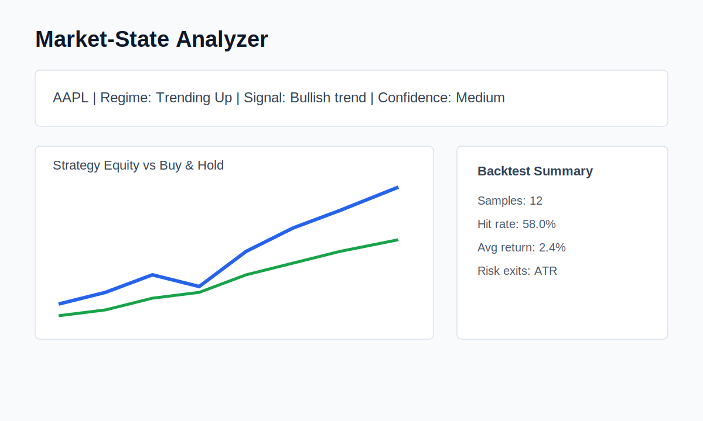

# Market-State Analyzer

A Python + Streamlit application for market-state analysis, signal backtesting, and risk management across stocks, crypto, and forex.

> **Disclaimer:** This project does not predict prices and does not constitute financial advice. It describes historical market conditions and compares similar past states.



## What it does

Rather than predicting where prices will go, this tool asks: "What has historically happened when market conditions looked like this?"

It fetches live data, classifies the current market state, runs a historical backtest on that signal type, and helps size positions based on actual risk.

## Features

| Feature | Description |
|---|---|
| **Technical Indicators** | SMA 20/50, EMA 20, RSI 14, ATR 14, Volatility |
| **Market State Classification** | Trend, momentum, and volatility regime |
| **Regime Detection** | Trending Up/Down, Volatile, Range Bound, Breakout/Breakdown |
| **Support & Resistance** | Structural highs/lows with proximity detection |
| **Signal Backtesting** | Hit rate, avg return, Sharpe ratio, max drawdown, confidence labels, and optional ATR exits |
| **Walk-Forward Testing** | Out-of-sample date-split evaluation across rolling folds |
| **Monte Carlo Simulation** | Resampled equity curves with expected/best/worst case and drawdown |
| **Risk Calculator** | ATR-based stops, Risk/Reward ratio, position sizing, and matching backtest exit controls |
| **Portfolio Analyzer** | Annualized return/volatility, correlation matrix, diversification score |
| **Market-State Explanation** | Plain-English narrative generated directly from live stats |
| **Watchlist Scanner** | Composite-scored ranking across multiple symbols |
| **Trade Log Export** | CSV download of all historical trades |
| **Multi-asset** | Stocks, crypto (BTC-USD), forex (EURUSD=X) |

## Market-State Explanation

Every single-symbol analysis includes a plain-English explanation of the current market state, generated directly from the live stats: regime, RSI, signal, structure, and the signal's historical sample. This always works locally with no API key, network call, or model dependency.

## Backtesting

For each signal type, the engine finds historical occurrences, simulates a fixed holding-period exit, applies transaction costs, and reports hit rate, average return, max drawdown, annualized Sharpe ratio, win/loss ratio, and best/worst trade.

Small historical samples are flagged in the UI with confidence labels: low confidence below 10 trades, medium below 30, and higher confidence at 30 or more. Hit rate, Sharpe ratio, and average return can swing heavily with only a few matching signals. The backtest can also use optional ATR stop-loss and take-profit exits instead of only a fixed holding-period exit.

## Walk-Forward Testing

Walk-forward testing splits the data into sequential date windows and scores each later test window separately. The signal rules are fixed rather than fitted, so this is a date-split robustness check, not parameter optimization.

## Methodology Notes

- Market state uses rule-based indicators: moving averages, RSI, volatility, and recent structure.
- Backtests compare historical occurrences of the same signal.
- ATR risk exits are optional. If a stop and take profit are both touched in one bar, the stop is assumed first.
- Walk-forward testing is a sequential date split with fixed rules, not parameter fitting.
- Monte Carlo resamples historical trade outcomes. It is not a price forecast.

## Cache Location

Downloaded market data is cached under the project-level `cache/` directory by default, regardless of the shell's current working directory. Set `MARKET_STATE_CACHE_DIR` to use a different cache location.

## Quickstart

```bash
git clone https://github.com/sander2501/market-state-analyzer.git
cd market-state-analyzer
python -m venv venv
source venv/bin/activate
pip install -r requirements-dev.txt
pip install -e .
python -m streamlit run ui/streamlit_app.py
```

## Example Output

See `examples/AAPL_report.md` and `examples/sample_trade_log.csv` for sample generated outputs.

## Docker

```bash
docker build -t market-state-analyzer .
docker run -p 8501:8501 market-state-analyzer
```

## Project Structure

```text
market-state-analyzer/
├── ui/streamlit_app.py
├── core/
│   ├── indicators.py
│   ├── market_state.py
│   ├── regime.py
│   ├── signals.py
│   ├── structure.py
│   ├── risk.py
│   ├── portfolio.py
│   ├── ai_explanation.py
│   ├── scanner.py
│   ├── explanations.py
│   ├── charts.py
│   └── report.py
├── data/providers.py
├── backtesting/
│   ├── engine.py
│   ├── walk_forward.py
│   └── monte_carlo.py
├── tests/
└── main.py
```

## Common Commands

```bash
make install-dev
make test
make lint
make run
```

If `make` is not installed, run the underlying commands directly:

```bash
pip install -r requirements-dev.txt
pip install -e .
pytest
ruff check .
python -m streamlit run ui/streamlit_app.py
```

## Running Tests

```bash
make test
make lint
```


## Screenshots

A lightweight preview is included at `docs/screenshots/app-preview.svg`. For a portfolio showcase, replace or supplement it with real screenshots from a local Streamlit run.
